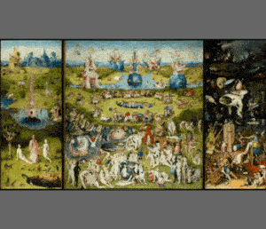

This plugin allows you to draw vector annotations over [OpenSeadragon](https://openseadragon.github.io/) deep zoom images. The plugin creates the drawings on a SVG overlay that scales with the image.



## Usage

### Installation

You will need both OpenSeadragon and this plugin. You can [download](https://github.com/Emigre/openseadragon-annotations/releases) the plugin manually or install it with a package manager like Bower or npm.

```console
npm install openseadragon openseadragon-annotations --save-dev
```

Once OpenSeadragon and the plugin are included in your page, you can start an OpenSeadragon viewer with the plugin in this way:

```javascript
var viewer = OpenSeadragon({
    id: 'viewer',
    showNavigator:  true,
    tileSources: {
        Image: {
            xmlns: 'http://schemas.microsoft.com/deepzoom/2008',
            Url: 'http://content.zoomhub.net/dzis/TDbz_files/',
            Format: 'jpg',
            Overlap: '1',
            TileSize: '254',
            ServerFormat: 'Default',
            Size: {
                Height: '4409',
                Width: '7793'
            }
        }
    }
});

viewer.initializeAnnotations();
```

The viewer screen will have an additional set of icons at the bottom-left side, that you can use to toggle the drawing mode and draw annotatations over the image.

### Initialization

Once the plugin is loaded, when you create a OpenSeadragon viewer object, it will have three additional methods that allow you to trigger the plugin.

To initialize the plugin use `viewer.initializeAnnotations();`. The plugin will then wait until an image is loaded in the page (open event) to create the vector overlay that allows you to draw.

To check the state of the plugin, call `viewer.areAnnotationsActive();`, it will return a boolean. Note that the plugin could be active and waiting for the image to load.

To shut down the plugin use `viewer.shutdownAnnotations();`. This will destroy the overlay and remove the buttons and event handlers. The plugin can be started again later in the usual way.

### Interacting with the plugin

When the plugin is installed, your `viewer` object gains a property object named `annotations` that allows you to interact with it. Through this object's methods you can set and retrieve the current annotations.

Calling `viewer.annotations.get()` will return an Array of annotations. Annotations are themselves arrays as well, composed of two elements: a name tag which is a String, and an object describing the properties of that tag.

You can call `viewer.annotations.set()` and pass one of those Array of Arrays to reset the current drawing to that particular data.

`viewer.annotations.clean()` will erase all annotations currently on screen.
